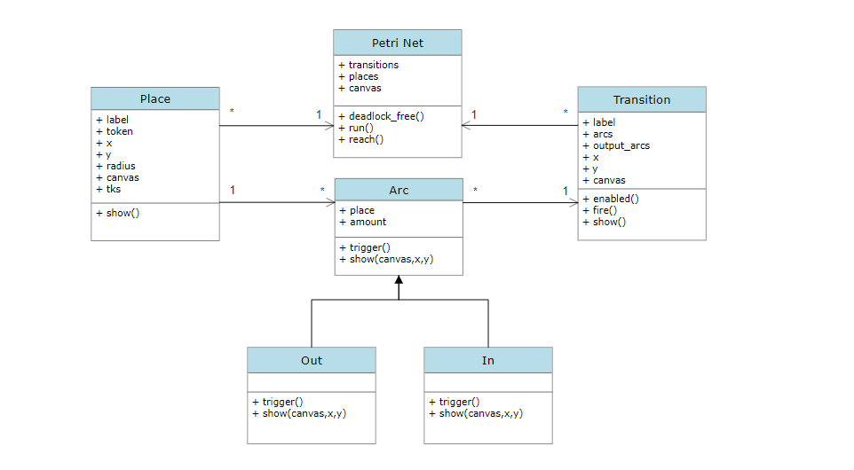

# Petri Net with Visualization

## Description

An implementation of a Petri Net in Python 3.9.7 with homework-solving visualization

## Prerequisites

Make sure to have Python 3.9 installed on your PC / Mac.

Some modules required:
- tkinter : a python module to create GUI 
- math: trigonometric calculation

Use ```pip``` command to install those modules above.

```console
    pip install --upgrade pip
    pip install tkinter math
```
- - -
## Design

A Petri Net contains places, transitions and arcs. Each of these components has their own properties and behaviors. They also interact with each other in a specific way. Object-oriented programming is a great way to implement such a model like Petri Net. 

### **Detail**

1. Place:
+ Properties:
    - label: name of a place
    - token: number of tokens holding 
2. Arc:
+ Properties:
    - place: place in a petri net
    - amount: set throughput limit, default is 1
+ Method:
    - trigger(): fully implemented by derived class
3. Out: derived from Arc, 
+ Method:
    - trigger: take an amount of token(s) from an input place every call
3. In: derived from Arc, 
+ Method:
    - trigger: send an amount of token(s) to an output place every call
4. Transition:
+ Properties:
    - label   : name of a transition
    - arcs    : list of directed arcs
    - out_arcs: list of output arc
+ Methods:
    - enabled : determine a transition is ready to fire
    - fire    : when enabled, tokens which are set amount to be taken in each input arc are distributed to each output arc

5. PetriNet:
+ Properties:
    - transitions: dictionary of transitions
    - places: list of places
    - canvas: where to illustrate petri-net
+ Methods:
    - deadlock_free : determine a current marking of a petri net can be fired
    - run     : simulate a petri net
    - reach   : find all transtions / construct a transition system.

### **UML Class Diagram** 



- - -
## Algorithm

### Find all reachable markings of a petri net (or construct a transition system from a petri net)

Since each marking has at most n next markings in case of at most n enabled transitions, we will retrieve markings at every paths we can explore by applying Greedy's algorithm in the form of Breadth-first Search (BFS) algorithm. A Queue stores next transitions of the front and iteratively pops front after finding all enabled markings until a queue is empty. 

Pseudo-code:
```code
Function reach()
    ts as a list
    transition as a dictionary
    reachable_marking as a queue
    Assign initial markings to the queue
    while reachable_marking is not empty
        front = reachable_marking.front()
        for name in transitions
            if transitions[name].fire():
                retrieve marking from places
                if marking is not in reachable_marking and ts:
                    reachable_marking.push(marking)
        reachable_marking.pop()
        ts.push(front)
    return ts
```

### Find markings are reachable from M<sub>0</sub> by firing one transition once

Same strategy as above, this time a container keeps track of used transitions.

Pseudo-code:
```code
Function reach_once()
    ts as a list
    visited as a boolean dictionary
    transition as a dictionary
    reachable_marking as a queue
    Assign initial markings to the queue
    while reachable_marking is not empty
        front = reachable_marking.front()
        for name in transitions
            if not visited[name] transitions[name].fire():
                retrieve marking from places
                if marking is not in reachable_marking and ts:
                    reachable_marking.push(marking)
        reachable_marking.pop()
        ts.push(front)
    return ts
```
- - -
## Execution

Navigate your terminal to this local project directory. Simply type:
```console
    py petri_net.py
```
Change ```py``` into ```python``` or ```python3``` depending on your version of your Python.
- - -
